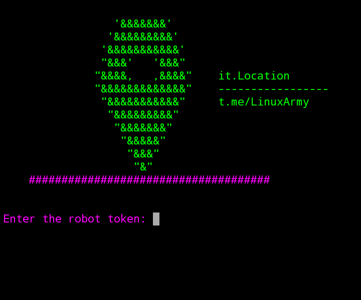

# it.Location

get target location by link

 
# prerequisites
<pre><code>
apt update  
apt install git php python3 -y  
pip3 install pyTelegramBotAPI 
</code></pre>

# Installation and execution
<pre><code>
git clone https://github.com/it4min/itlocation  
cd itlocation  
python3 Location.py
</code></pre>

# Video Tutorial
Youtube : https://youtu.be/MqrEVSyCR8k
 

# Telegram Channel 
<a href="https://t.me/LinuxArmy">Click to join<a> 
